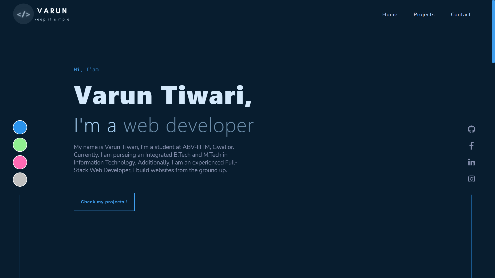

<p align='center'>

</p>
<p align='center'>
<b>Personal portfolio website</b>
</p>
<p align='center'>
<a href='https://varun-tiwari.netlify.app/' target='_blank'>varun-tiwari.netlify.app</a>
</p>

---

<p align='center'>
This is my portfolio website build with <a href='https://reactjs.org' target='_blank'>react</a> and hosted with <a href='https://app.netlify.com/' target='_blank'>netlify</a>
</p>

<p align="center">
   <a href="https://app.netlify.com/sites/varun-tiwari/deploys" target="_blank">
      
   </a>
</p>

<p align='center'>

</p>

#### 🛠 Installation and setup

1. Clone the repo to your local machine.
2. Install the required dependency using :

   ```javascript
   npm install
   ```

3. Start the development server using :

   ```javascript
   npm start
   ```

#### 🏎 Creating production built

1. Preview production build :

   ```javascript
   npm run serve
   ```

2. Create a production build using the command :

   ```javascript
   npm run build
   ```

<br>
<br>
<br>

<p align='center'>
(If you liked the project, give it a star 😃)
</p>
